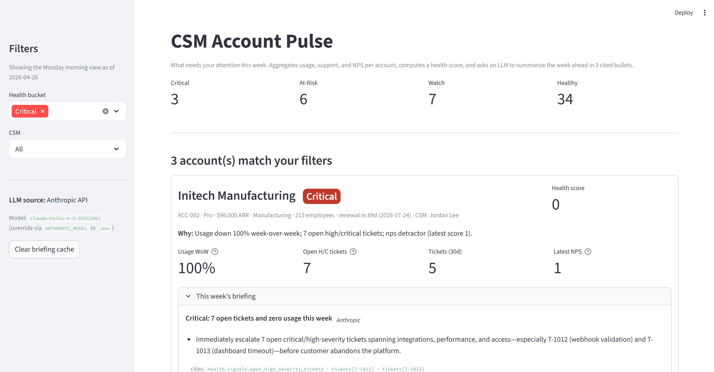

# csm-account-pulse

[](https://github.com/kgr1115/csm-account-pulse/actions/workflows/ci.yml)

A single-page Streamlit dashboard a CSM opens every Monday to see which of their accounts need attention this week. Aggregates synthetic CRM/usage/ticket data per account, computes a health score, and an LLM generates a 3-bullet "what to focus on this week" briefing per account, with citations to the underlying signals. The briefing prompt has shipped through five documented iterations (v1 → v5) — see [`evals/`](evals/) for the receipts.

## Who this is for

Customer Success Managers — and the people hiring them. Built as a portfolio piece illustrating the kind of internal AI tool an AI Implementation Specialist would deploy at a non-AI company. Shows account-level data thinking, structured LLM output, prompt versioning, and CSM workflow understanding.

## Screenshot

The Monday-morning view, filtered to the Critical bucket. Each account card surfaces a 3-bullet briefing generated by the live Anthropic call (the badge in the top-right corner of the briefing reads "Anthropic" — when no API key is set it reads "Stub" and the dashboard still runs end-to-end). Every bullet's `cites:` line links back to the specific fixture field — ticket IDs, NPS dates, signal names — that the briefing rests on; that's what `test_every_citation_resolves_to_a_real_fixture_field` enforces.



A close-up of a single account's briefing card — Globex Robotics, ACC-001, Critical bucket. The "Anthropic" tag in the briefing header is the live-path indicator (the stub renders the same shape with a "Stub" tag). Every bullet ends with a `cites:` row of green chips — `tickets[T-1000]`, `nps[2026-04-16T14:00:00]`, `usage_window.days_to_renewal`, etc. — each one a fixture field the briefing actually rests on. The `usage_window.days_to_renewal` and `usage_window.events_last_7d` chips are the v4/v5 receipts: precomputing those values in the LLM payload is what fixed the day-count hallucinations the v3-vs-v4 eval surfaced.


## Quick start

```bash
git clone <this-repo>
cd csm-account-pulse
pip install -r requirements.txt
python -m streamlit run app.py
```

`pytest` runs the test suite. Anthropic API key is optional — without one, the dashboard renders briefings from a deterministic stub so the demo runs end-to-end. Copy `.env.example` to `.env` and paste your key there to switch on the live model.

## Bring your own CRM data

`CsvDataSource` lets a CSM (or their data person) point the dashboard at a real CRM export instead of the synthetic fixtures. Drop four CSV files — `accounts.csv`, `usage_events.csv`, `tickets.csv`, `nps_responses.csv` — into a directory on your machine and the same briefing path runs against your data. The fixture path stays the default; nothing about the fork-and-run demo changes.

```python
from datasources import CsvDataSource

ds = CsvDataSource("/path/to/your/csv/dir")
```

See `docs/datasources/csv.md` for the column schema, accepted date formats, required-vs-optional columns, and a worked example. The default runtime directory `data/csv/` is gitignored so a real CRM export can never accidentally land in git; synthetic 5-row examples for shape reference live under `data/samples/`.

## What's inside

- **`app.py`** — the Streamlit dashboard. One page; opens on accounts ranked by health bucket then score.
- **`models.py`** — Pydantic models for every entity (Account, UsageEvent, Ticket, NpsResponse) and for the validated `Briefing` output. Each `BriefingBullet` is required to carry at least one citation.
- **`datasource.py`** — the `DataSource` interface and `FixtureDataSource`, the only implementation. All reads flow through here.
- **`health.py`** — composes usage decay + ticket volume + NPS into a 0–100 score with categorical bucket and per-signal breakdown.
- **`briefing.py`** — the LLM call. Pydantic + JSON-mode against Anthropic. Falls back to a deterministic stub when the API key is unset or validation fails — both paths produce the same shape.
- **`prompts/briefing.md`** — versioned prompt for briefing generation. Bumped on any wording change.
- **`scripts/generate_fixtures.py`** — deterministic fixture generator. Three accounts (Globex, Initech, Hooli) are hand-crafted to land in the Critical bucket so the demo has unmissable signals.
- **`data/fixtures/`** — 50 accounts × 90 days of usage events, plus tickets and NPS responses.
- **`tests/`** — DataSource contract, health-score boundaries, and a regression that every citation in every briefing resolves to a real fixture field.

## Architecture — the load-bearing rule

Every data read flows through a `DataSource` interface:

```python
class DataSource(Protocol):
    def list_accounts(self) -> list[Account]: ...
    def get_usage_events(self, account_id: str, since: date) -> list[UsageEvent]: ...
    def get_tickets(self, account_id: str) -> list[Ticket]: ...
    def get_nps_responses(self, account_id: str) -> list[NpsResponse]: ...
```

`FixtureDataSource` is the only concrete implementation. The interface is the load-bearing claim — it's what makes the next section credible.

## What it would take to swap in Salesforce

The fixtures are not the architecture; the interface is. Replacing synthetic data with a real CRM is a localized change:

1. **New implementation: `SalesforceDataSource(DataSource)`** in `datasource_salesforce.py` (or wherever you keep adapters).
   - `list_accounts()` → `SOQL: SELECT Id, Name, ... FROM Account WHERE OwnerId = :csm_id`
   - `get_usage_events(account_id, since)` → either a custom object query (`SELECT ... FROM Usage_Event__c WHERE Account__c = :account_id AND CreatedDate >= :since`) or a Snowflake/Redshift query if usage telemetry lives in the warehouse rather than Salesforce itself.
   - `get_tickets(account_id)` → `SELECT Id, Subject, Priority, Status, CreatedDate FROM Case WHERE AccountId = :account_id`
   - `get_nps_responses(account_id)` → wherever NPS lives (often a separate vendor like Qualtrics or Delighted; another adapter, same interface).

2. **Auth:** OAuth 2.0 web server flow against Salesforce. Refresh token stored in OS keyring (e.g. `keyring.set_password("csm-account-pulse", "salesforce-refresh", token)`); never on disk. Anthropic API key already follows the same pattern via `.env`.

3. **Caching:** real CRM calls are slow and rate-limited. Wrap `SalesforceDataSource` methods in `@functools.lru_cache` (in-memory) or `diskcache` (per-session) keyed on `(account_id, since)`. Streamlit's `@st.cache_data` continues to wrap the dashboard-level calls.

4. **Config wiring:** in `app.py`, replace
   ```python
   data_source = FixtureDataSource("data/fixtures/")
   ```
   with
   ```python
   data_source = SalesforceDataSource(
       client_id=os.environ["SF_CLIENT_ID"],
       refresh_token=keyring.get_password("csm-account-pulse", "salesforce-refresh"),
   )
   ```
   No other application code changes. The dashboard, health score, and briefing call sites all already speak `DataSource`.

5. **Health-score & briefing tuning:** synthetic fixtures are tuned to make the demo legible. Real Salesforce data will have different distributions (more noise, fewer pure at-risk signals, more partial nulls). The health-score weights and the briefing prompt would need a calibration pass against real data — a few days of work, not a rewrite.

6. **Out of scope (deliberately):** writing back to Salesforce. This dashboard is read-only; the architecture has no `DataSink` symmetric to `DataSource`. Adding actions (auto-task creation, etc.) is a separate scope conversation, not an integration step.

The total effort estimate: ~3-5 days for a single CRM, most of it in OAuth setup, schema mapping, and health-score recalibration. The interface boundary is what makes that estimate small instead of "weeks."

## What it would take to add persistence (notes, "actioned" flags, follow-ups)

The dashboard is intentionally read-only and stateless — a CSM acts in their CRM, this surface tells them what to act on. The first feature request that comes back from a real user is "let me mark a briefing as actioned" or "let me note who I emailed." The architecture handles this the same way it handles the CRM swap: a new Protocol, a new adapter, the call sites stay the same.

1. **New Protocol: `NotebookStore`** (next to `DataSource` in `datasource.py` or a sibling file).
   ```python
   class NotebookStore(Protocol):
       def get_notes(self, account_id: str) -> list[Note]: ...
       def add_note(self, account_id: str, body: str, author: str) -> Note: ...
       def mark_actioned(self, account_id: str, briefing_id: str, by: str) -> None: ...
       def list_followups(self, csm: str, due_before: date) -> list[Followup]: ...
   ```

2. **First implementation: `JsonNotebookStore`** in `notebook_json.py`. Persists to `data/notebooks/{account_id}.json` per account. No DB dependency, no auth, runs on a recruiter's laptop. Same pattern as `FixtureDataSource` — just a JSON file per entity. Atomic writes via tempfile + rename so a crash mid-write can't corrupt a notebook.

3. **Real backend swap (`SqliteNotebookStore`, `PostgresNotebookStore`):** identical shape to the Salesforce swap above — new file, new class, instantiated in `app.py`. Storage choice is a deployment concern, not an application concern.

4. **Wiring in `app.py`:** the dashboard injects `NotebookStore` next to `DataSource`. Each account card gets:
   - An "Actioned this week" checkbox bound to `mark_actioned`.
   - A note input bound to `add_note`.
   - A "Notes from prior weeks" section bound to `get_notes`.
   None of these touch the briefing path, the health score, or the CRM read path.

5. **Briefings become idempotent over time:** the briefing for a given week + account becomes citeable in next week's briefing ("last week you flagged the SSO regression — it's now resolved per `tickets[T-1042].resolved_at`"). That's a prompt change, not an architecture change.

6. **Out of scope (still):** writing back to the CRM (no `DataSink` for Salesforce). Notes live in our store, not in the CRM. A future "sync to Salesforce activity log" is a separate adapter on the same `NotebookStore` Protocol — `SyncedSalesforceNotebookStore` decorating `JsonNotebookStore` with a write-through to Activity records.

The total effort estimate: ~1-2 days for the JSON adapter and the UI bindings, plus another ~1-2 days when a real DB or write-through-to-CRM becomes the production target. The Protocol boundary is what makes that estimate small instead of "rewrite the dashboard for stateful UX."

## Health scoring — see `health_scoring.md`

The composite 0–100 health score is a hand-tuned linear deduction model — small enough to read top-to-bottom, interpretable enough to defend. `health_scoring.md` documents each weight, the rationale behind the threshold, and what changing it would do. Anyone calibrating the scoring against real CRM data should start there.

## Prompt evals — see `evals/`

The README claims the prompt is "bumped on any wording change," and `prompts/briefing.md` carries a `# v5` header. The corollary every reviewer asks about: *how do you know each version is better than the last?* [`evals/README.md`](evals/README.md) is the v1 → v5 narrative — what each bump targeted, what failure mode it fixed, and what the next-iteration target was. [`evals/methodology.md`](evals/methodology.md) documents the held-out scenario set (5 accounts spanning Critical → Healthy) and the grading rubric. `scripts/run_eval.py` is the runner; it emits per-bullet PASS/FAIL receipts for renewal-prose accuracy alongside the schema/citation checks. Result files commit alongside the prompt change, never separately.

## Why the tests matter

The test suite is small (31 tests) but each one defends a specific failure mode that would erode trust in the dashboard or break the recruiter-facing demo:

- **`test_every_citation_resolves_to_a_real_fixture_field`** — guards the "the LLM will invent signals" failure mode. Walks every citation in every briefing and asserts each one points at a fixture field that actually exists. Without this, a model could cite `tickets[T-9999]` and look authoritative about a ticket nobody can find.
- **`test_three_handcrafted_accounts_are_in_critical_bucket`** — guards the demo screenshot. The first three fixtures (Globex, Initech, Hooli) are hand-crafted with overlapping usage decay + ticket spike + bad NPS so the dashboard always has unmistakable signals. A scoring tweak that quietly moves them to "Watch" would gut the demo.
- **`test_state_to_llm_payload_runs_without_api_key`** — guards the live-path code that pytest can't run for free. `_state_to_llm_payload` only executes when an Anthropic key is set, so a NameError or bad import there would only show up on a paid call. This pure-function test keeps the live-path import surface honest.
- **`test_live_path_*`** (seven tests, mocked Anthropic client) — exercise the live branch end-to-end without spending a token: happy path, ```json fence stripping, bare ``` fence stripping, malformed-JSON fallback, schema-validation fallback, account-id-mismatch fallback, and the SDK-not-installed fallback.
- **`test_critical_accounts_briefings_lead_with_remediation`** — keeps Critical-bucket briefings concrete. The first bullet must mention tickets, usage, resolution, or the renewal — never a generic "this account needs attention" platitude.

The pattern: every test maps to a specific way the system could lie to the CSM, and the suite is sized to defend exactly those lies.

## Tech stack

- Python 3.13
- Streamlit (dashboard)
- Pydantic + Anthropic API JSON-mode (structured LLM output)
- pytest

## License

MIT
